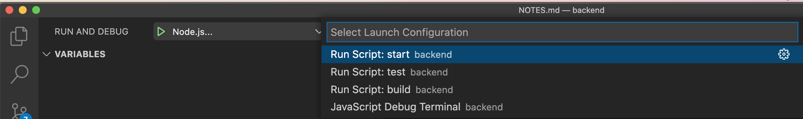

# Barcelona API - NodeJS/Express, DynamoDB, Dynamoose, Zod and Typescript

<details>
  <summary>Quick Start</summary>

  
  ```ts
  # waiting for watch command
  yarn run build
  # runs app locally
  yarn start

  ```

</details>

<details>
  <summary>Codebase Intro</summary>
  
  ---
  Initial packages which were installed:
  ```bash
  # Packages
  npm install express zod config cors dotenv express @aws-sdk/client-dynamodb http-status-codes pino pino-pretty prom-client response-time dayjs bcrypt jsonwebtoken lodash nanoid dynamoose uuid

  # Types
  npm install @types/body-parser @types/config @types/cors @types/express @types/node @types/pino @types/bcrypt @types/jsonwebtoken @types/lodash @types/nanoid @types/response-time @types/uuid ts-node-dev typescript -D
  ```

</details>

<details>
  <summary>Linting and Code Quality</summary>

  # Linting and Code Quality Setup

  This project uses **Biome** for code linting/formatting and custom scripts to enforce `.js` extensions in ES module imports.

  ## 🛠️ Tools Used

  - **[Biome](https://biomejs.dev/)** - Fast formatter and linter for JavaScript/TypeScript
  - **Custom import checker** - Ensures `.js` extensions are used in relative imports

  ## 📝 Available Scripts

  ### Linting Commands
  ```bash
  # Check all (code style + imports)
  yarn lint

  # Fix all issues automatically
  yarn lint:fix

  # Check only code style/formatting
  yarn lint:code

  # Fix only code style/formatting
  yarn lint:code:fix

  # Check only import extensions
  yarn lint:imports

  # Fix only import extensions
  yarn lint:imports:fix

  # Format code
  yarn format
  ```

  ## 🎯 Why .js Extensions?

  Since this project uses ES modules (`"type": "module"` in package.json), Node.js requires explicit `.js` extensions for relative imports, even in TypeScript files:

  ```typescript
  // ❌ Wrong - will cause runtime errors
  import { config } from './config';
  import routes from './routes';

  // ✅ Correct - works with ES modules
  import { config } from './config.js';
  import routes from './routes/index.js';
  ```

  ## 🔧 VS Code Integration

  The project includes VS Code settings (`.vscode/`) that:
  - Use Biome as the default formatter
  - Format on save
  - Provide tasks for linting commands

  ### Available VS Code Tasks
  1. **Lint: Check All** (Ctrl/Cmd + Shift + P → "Tasks: Run Task")
  2. **Lint: Fix All**
  3. **Lint: Check Imports Only**
  4. **Lint: Fix Imports Only**
  5. **Format Code**

  ## 🪝 Git Hooks

  A pre-commit hook automatically checks import extensions before each commit:
  - ✅ Commits succeed if all imports are properly formatted
  - ❌ Commits are blocked if `.js` extensions are missing
  - 💡 Provides helpful fix commands when issues are found

  ## 🚨 Common Issues & Solutions

  ### "Directory import not supported" Error
  ```
  Error [ERR_UNSUPPORTED_DIR_IMPORT]: Directory import '/path/to/handlers' is not supported
  ```

  **Solution:** Use explicit index file imports:
  ```typescript
  // ❌ Wrong
  import { handler } from './handlers';

  // ✅ Correct
  import { handler } from './handlers/index.js';
  ```

  ### Import Extension Missing
  ```
  ❌ Found 1 import(s) missing .js extensions in 1 file(s).
  ```

  **Solution:** Run the auto-fix command:
  ```bash
  yarn lint:imports:fix
  ```

  ## 🔄 Workflow

  1. **Write code** with proper imports (VS Code will help format)
  2. **Save files** (auto-formatted by Biome)
  3. **Commit changes** (pre-commit hook validates imports)
  4. **If issues found**, run `yarn lint:fix` and commit again

  This setup ensures your ES modules work correctly in Node.js while maintaining code quality! ✨

</details>

<details>
  <summary>Setup on Local Machine</summary>

  # Environment Config
  ## Secret Config, dotenv (`.env`)

  Create a `.env` file and setup environment variables which will be available in `process.env`
  > Do not commit these to the repo. There is a gitignore entry to prevent this also.


  ## General config (stored in Repo)
  ```ts
  // this will import config values from config: ./config/default.ts
  import config from "config";
  ```

  # Install the app

  ```bash
  yarn install
  ```

  # Start the app

  ```bash
  yarn start
  ```

</details>

<details>

  <summary>Building app locally (+ local hosting)</summary>

  ```bash
  # use node 16, if not already
  nvm use v16
  # build app
  npm run build
  # host local server
  node --experimental-specifier-resolution=node build/src/app.js
  ```

  > Probably works with node v18, but not tested!

</details>

<details>
  <summary>Debugging</summary>

  # Debugging app in VSCode (with breakpoints)

  https://code.visualstudio.com/docs/nodejs/nodejs-debugging

  Setup Nodejs... configuration first

  

  Then, do:

  Debug -> Run Script: start

</details>

<details>
  <summary>HTTP Status Codes</summary>

  # HTTP Status Codes

  There is a [full list here](./HTTP_CODES.md)

</details>

<details>
  <summary>Hosting & Deployment</summary>

  # Hosting

  The app is hosted on AWS

  ## Deploying to Production - TODO!

  To deploy to production, merge to `main` branch. Deployment will happen automatically using Github Actions.
</details>

<details>
  <summary>Processing images & uploading to S3</summary>

  Help: https://docs.aws.amazon.com/cli/latest/reference/s3/sync.html

  1. Run script: `node ./src/processImages/script.js`
  2. Sync to S3: `npm run sync:images:thumb` (or all)

</details>


<details>
  <summary>EC2 secrets</summary>

  In the code we are accessing `process.env` variables (ex: `process.env.AWS_S3_BUCKET`).
  
  On Local dev they are in the .env file.
  
  On AWS EC2 instance, they are stored here:

  ```sh
  # /etc/profile
  
  # /etc/environment << NOTE, this doesn't seem to work so use profile!!!
  # https://superuser.com/questions/664169/what-is-the-difference-between-etc-environment-and-etc-profile
  
  # Inside file:
  export AWS_S3_BUCKET=XXX
  ...

  ```

  Using vim:

  ```sh
  sudo vim /etc/profile
  # File opens
  # You are in command mode. Hit "i" on keyboard for Insert mode

  # -- Make changes --

  # Exit insert mode: Escape key
  
  # Save changes by writing to the file
  # Write changes:
  # :w
  # Quit:
  # :q

  # Close without saving changes (from command mode)
  # :q!

  # There is also visual mode (v on keyboard)

  ```
  
  > Note: Now you might need to restart the service!


  ---

  # Random shit which might one day help!

  ## Environment Variables on Linux:

  Open the AWS terminal on the instance:

  ```sh
  # List all exported vars
  export -p
  ```

  ## See what environment vars are available to the node process running the API

  ```sh
  # show all processes running
  ps faux
  # find: ec2-user ... /usr/bin/node --experimental-specifier-resolution=node /home/ec2-user/barcel...

  # Can also do this for the PID:
  sudo systemctl status nodeapi

  # Ex: process ID = 1837
  ps faux | grep '1837'

  # Show vars
  cat /proc/1837/environ

  # More readable - same as the above
  strings /proc/1837/environ


  # export a new one:
  # use export FOO=BAR
  export MY_ENV_VAR=https://cdn.pocketbarcelona.com

  # view all exported vars: just run without args:
  # export

  # Also in:
  /etc/profile.d/sh.local

  ```

  ```sh
  # Random shit just in case!
  
  cat /etc/environment 
  sudo vim /etc/profile
  node --experimental-specifier-resolution=node src/app.js
  sudo systemctl status nodeapi
  pkill node
  sudo pkill node
  sudo systemctl start nodeapi
  sudo systemctl status nodeapi
  journalctl -u nodeapi.service
  which node
  sudo nano /lib/systemd/system/nodeapi.service
  sudo systemctl enable nodeapi.service
  sudo systemctl start nodeapi.service
  sudo systemctl status nodeapi

  journalctl -u nodeapi.service
  sudo systemctl stop nodeapi.service
  sudo systemctl star nodeapi.service
  sudo systemctl start nodeapi.service
  
  curl localhost:3002/healthcheck
  curl localhost:3002/healthcheck -v
  ```
  

</details>

<details>
  <summary>Restart EC2 instance</summary>

  From AWS -> EC2.
  Instances: Reboot

  Then, on EC2 console:

  ```sh
  sudo systemctl restart nodeapi.service
  sudo systemctl status nodeapi
  ```
</details>

<details>
  <summary>TODO - Importing events into Dynamo and Google Calendar</summary>

  1. Master events list is in Google Sheets. Make sure the UUID field is set for each
  2. Download the `"Events_CSV"` table as a CSV
  3. Find and replace in the exported file: `"""` > `"` (so that there’s only 1 set of quotes)
  4. Run the Events -> import endpoint, which will upsert Dynamo DB: http://localhost:3002/api/events/aws/sync
  5. TODO: Run the Events -> import endpoint, which will upsert Google Calendar
  6. Version the CSV file in repo
  7. Check event by ID: http://localhost:3002/api/events/99

</details>
